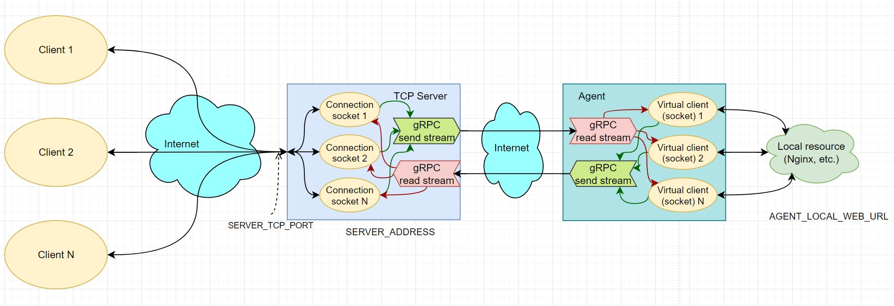

# TCP-tunnel

## Architecture

* Clients can interact with server independently. Fail or slowness of one of them does not affect the others.

* Can be used for remote access by any tcp-based protocol, including http

## Technologies:
* Rust language: [Tokio](https://tokio.rs/) runtime, [Tonic](https://docs.rs/tonic/latest/tonic/) (gRPC)

## Run:

### Docker (recommended):

* Check and configure if needed [`.env`](./.env) file
* Place some content for Nginx into [`nginx/content/`](./nginx/content/) (if empty the default Nginx welcome page will be shown)
* `./run_agent.sh`
* `./run_server.sh`

Now you can access Nginx content using TCP tunnel: go to `localhost:$SERVER_TCP_PORT`

### Local run:
* Install Rust if you don't have it: `./install_rust.sh`
* Modify [`.env`](./.env) file for local run
* Modify [`docker-agent.yml`](./docker-agent.yml) for local run (disable agent service)
* Run Nginx: `./run_agent.sh`
* Run agent: `cargo run --release --bin agent`
* Run server: `cargo run --release --bin server`

Now you can access Nginx content using TCP tunnel: go to `localhost:$SERVER_TCP_PORT`